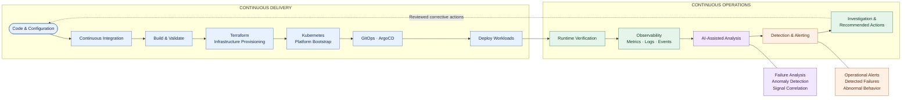

# KUBAPP — Execution Flow

```mermaid
flowchart LR
    subgraph DEV["CONTINUOUS DELIVERY"]
        direction TB
        A(["Code & Configuration"]) --> B["Continuous Integration"]
        B --> C["Build & Validate"]
        C --> D["Terraform<br/>Infrastructure Provisioning"]
        D --> E["Kubernetes<br/>Platform Bootstrap"]
        E --> F["GitOps · ArgoCD"]
        F --> G["Deploy Workloads"]
    end

    subgraph OPS["CONTINUOUS OPERATIONS"]
        direction TB
        H["Runtime Verification"]
        I["Observability<br/>Metrics · Logs · Events"]
        J["AI-Assisted Analysis"]
        K["Detection & Alerting"]
        L["Investigation &<br/>Recommended Actions"]
    end

    G --> H
    H --> I
    I --> J
    J --> K
    K --> L

    J --- J1["Failure Analysis<br/>Anomaly Detection<br/>Signal Correlation"]
    K --- K1["Operational Alerts<br/>Detected Failures<br/>Abnormal Behavior"]

    L -. "Reviewed corrective actions" .-> A

    classDef delivery fill:#e8f1ff,stroke:#4776b9,color:#172b4d
    classDef operations fill:#e5f5eb,stroke:#39845a,color:#153d27
    classDef ai fill:#f1e8ff,stroke:#8660b5,color:#34204d
    classDef alert fill:#fff0e5,stroke:#c27839,color:#542b12

    class A,B,C,D,E,F,G delivery
    class H,I,L operations
    class J,J1 ai
    class K,K1 alert
```
